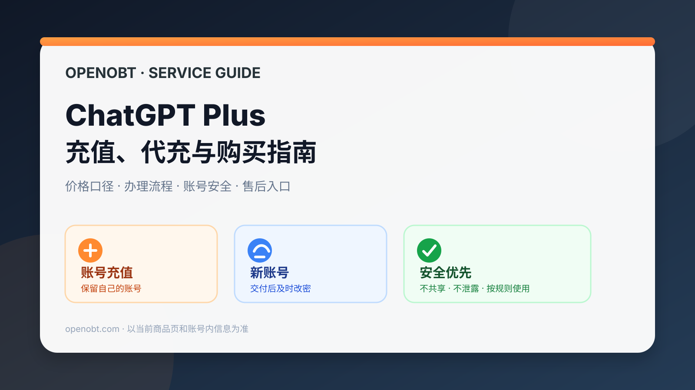
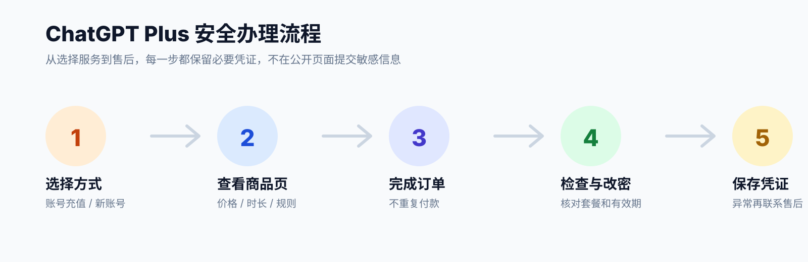

# ChatGPT Plus 充值、代充与购买指南

如果你正在搜索 ChatGPT Plus 充值、ChatGPT Plus 代充、ChatGPT Plus 购买、ChatGPT Plus 多少钱、ChatGPT Plus 账号充值或 ChatGPT Plus 新账号，这份指南把常见问题、办理方式、价格口径和账号安全注意事项整理在一起。

## 先看：账号安全优先

任何充值或账号服务都不能承诺“永不封号”。更稳妥的做法是：

- 按平台规则使用，不生成或传播违规内容；
- 不多人共用账号，不转售或公开账号；
- 不在 GitHub Issue、评论区或公开聊天中提交密码、验证码、恢复码或 API Key；
- 充值后及时检查套餐状态、有效期和登录安全设置；
- 尽量保持稳定的设备、网络和登录习惯，避免短时间内频繁切换异常环境；
- 发生异常时保留订单、时间和错误提示，通过商店页面提供的售后渠道处理。

“防封”应理解为减少不必要的账号风险和正确使用服务，不是绕过审核、规避平台限制或保证账号一定不会受到限制。

## ChatGPT Plus 充值价格

OpenAI 当前官方定价文档将 ChatGPT Plus 的价格基准列为 **$20/月**。官方套餐、功能和用量会持续调整，当前模型和用量应以账号内页面和 [OpenAI 官方定价文档](https://learn.chatgpt.com/zh-Hans/docs/pricing) 为准。

OpenOBT 的实际销售价格、活动价、可选时长和库存属于商店信息，不能用旧截图或旧文章代替，请直接查看当前商品页：

- [ChatGPT Plus 账号充值](https://openobt.com/products/top_up)
- [ChatGPT Plus 新账号](https://openobt.com/products/gpt_plus)

## ChatGPT Plus 代充流程

### ChatGPT Plus 充值需要什么？

需要准备的内容取决于当前商品页和订单流程。下单前请确认账号状态、需要办理的套餐和购买时长；不要在公开渠道发送密码、验证码或恢复信息。

### ChatGPT Plus 充值流程是什么？

通常可以按以下顺序办理：

1. 进入 OpenOBT 对应的 Plus 充值商品页；
2. 确认充值对象、时长、价格和售后范围；
3. 按商品页完成下单；
4. 根据订单页面提示完成必要的信息确认；
5. 充值完成后登录 ChatGPT，检查套餐状态和有效期；
6. 保存订单凭证，后续遇到异常时通过商店售后渠道处理。

### ChatGPT Plus 充值后有效期多久？

有效期取决于下单时选择的商品规格和时长。不要根据旧文章或他人截图判断，以下单页面显示的 SKU、起止时间和订单记录为准。

## ChatGPT Plus 购买方式

OpenOBT 当前提供两种 Plus 相关路径：

| 方式 | 适合谁 | 入口 |
| --- | --- | --- |
| ChatGPT Plus 账号充值 / 代充 | 已经有自己的账号，希望继续自己管理账号 | [查看 Plus 账号充值](https://openobt.com/products/top_up) |
| ChatGPT Plus 新账号 | 不想自行准备账号，希望直接使用已开通服务 | [查看 Plus 新账号](https://openobt.com/products/gpt_plus) |

### ChatGPT Plus 代充和新账号有什么区别？

代充是为已有账号办理套餐，账号和原有登录环境仍由用户自己管理；新账号是直接提供已开通服务的账号。选择前应考虑是否要保留原账号、是否需要迁移历史记录，以及自己是否愿意管理登录安全。

## ChatGPT Plus 账号充值

### 账号充值后如何登录？

充值完成后使用自己的原账号登录 ChatGPT，进入账户或套餐页面检查状态。若购买的是新账号，则按交付信息登录，首次登录后应及时修改密码并检查安全设置。

### 账号充值后看不到 Plus 怎么办？

先确认：

1. 登录的是下单时对应的账号；
2. 付款和订单状态已经完成；
3. 页面是否需要刷新或重新登录；
4. 当前页面显示的套餐起止时间是否正确。

仍然不一致时，保存订单信息和页面提示，通过 OpenOBT 商品页的售后渠道处理，不要重复付款。

## ChatGPT Plus 新账号

### 新账号收到后应该做什么？

1. 通过约定的方式接收账号信息；
2. 首次登录后立即修改密码；
3. 检查套餐名称、有效期和可用功能；
4. 保存恢复信息，不要与他人共用；
5. 不要将账号用于转售或公开分享。

### 新账号可以多人共用吗？

不建议多人共用。多人登录、频繁切换设备和异常登录环境都会增加账号安全风险，也会让售后判断变得困难。

## ChatGPT Plus 充值常见问题

### ChatGPT Plus 充值失败怎么办？

不要连续重复下单。先检查订单状态、账号状态、支付结果和页面错误信息，截图并记录发生时间，再通过商品页提供的售后渠道联系处理。

### ChatGPT Plus 多少钱一个月？

OpenAI 官方定价文档当前列出的 Plus 价格基准为 $20/月；OpenOBT 商店的人民币价格、活动价格和可选时长以当前商品页为准。

### 充值能保证不封号吗？

不能。任何服务都不应承诺绝对不受限制。能做的是减少共享账号、异常登录、违规使用和信息泄露等可避免风险，并按规则使用服务。

### Plus 的模型和功能会不会变化？

会。模型、功能和用量都可能更新。当前数据应以账号内显示和 [OpenAI 官方定价文档](https://learn.chatgpt.com/zh-Hans/docs/pricing) 为准，不建议把旧文章中的固定次数、旧模型名称或旧功能列表当作长期承诺。

## OpenOBT 当前服务入口

- [OpenOBT 商店首页](https://openobt.com/)
- [ChatGPT Plus 账号充值](https://openobt.com/products/top_up)
- [ChatGPT Plus 新账号](https://openobt.com/products/gpt_plus)

价格、库存、交付、质保和退款规则以对应商品页的最新说明为准。

## 相关说明

- 本仓库是 ChatGPT Plus 充值、代充、购买和新账号的服务指南，不保存任何账号密码、验证码、API Key 或客户订单信息。
- 本仓库的 OpenAI 套餐信息按 2026-09-20 官方文档整理；商店服务信息以 OpenOBT 当前页面为准。
- 本仓库不提供绕过审核、规避封禁或自动化滥用平台的技巧。
